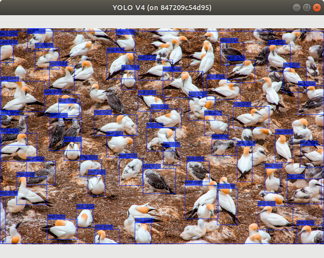
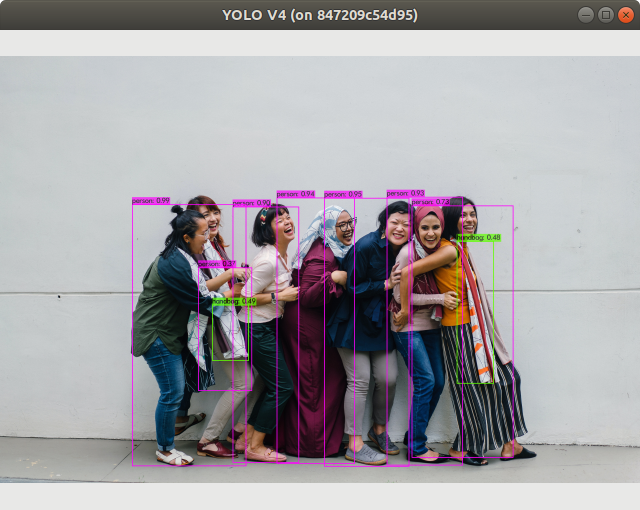
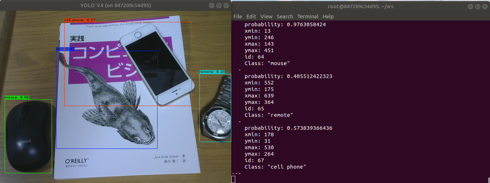

<!--
[](https://www.pexels.com/photo/woman-falling-in-line-holding-each-other-1206059/ "people")\
[](https://www.pexels.com/photo/flock-of-white-and-black-birds-on-ground-4023267/ "birds")\
-->

<div align = "center">


</div>

# YOLO V4 for darknet_ros
YOLO V4をdarknet_rosへ移植して使えるようにした環境です.


# Installation
このリポジトリを導入する環境では, すでに[ROS(Robot Operating System)](https://www.ros.org/)が導入されていることとします. ROSの導入方法は[ros.org](https://www.ros.org/install/)を参考にしてください. 私の[構築環境](#Environment)はこちらです.


## Create workspace
まずROSのワークスペースを生成します. `<workspace>`は任意の名前をつけてください.
```bash
## Create workspace for ROS, Change directory
$ mkdir -p workspace/src && cd workspace/src

## init workspace
$ catkin_init_workspace

## Make
$ cd ../
$ catkin_make
```

## Installation your environment
### Easy Installation
`darknet`と`darknet_ros`をsubmoduleとして扱うためには, `--recursive`をつけて　cloneしてください.
これによりsubmoduleである2つのリポジトリをまとめてcloneすることができます.
```bash
$ cd src
$ git clone --recursive https://github.com/Tossy0423/yolov4-for-darknet_ros.git
```

### `darknet`と`darknet_ros`をsubmoduleとして扱わずclone
`darknet`と`darknet_ros`をsubmoduleとして扱わないためには, ２つのリポジトリを別々にcloneする必要があります.
```bash
$ git clone https://github.com/Tossy0423/darknet.git
$ git clone https://github.com/Tossy0423/darknet_ros.git
```
このやり方の場合, フォルダのツリー構造は以下のようになります,
```
src
├── darknet
│
├── darknet_ros
```

## Download weights file
weightsはファイルサイズが大きので別でダウンロードする必要があります.
weightsファイルを導入する場所は, `darknet_ros/darknet_ros/yolo_network_config/weights`へダウンロードしてください.
```bash
$ wget https://github.com/AlexeyAB/darknet/releases/download/darknet_yolo_v3_optimal/yolov4.weights
```


## make pkg
```bash
# Change workspace directory
$ cd workspace

## Make
$ catkin_make

# Write source command in ~/.bashrc
$ echo "source ~/workspace/devel/setup.bash" >> ~/.bashrc
```


# Environment

|         Topics         	|                     Spec                     	|
|:----------------------:	|:--------------------------------------------:	|
|          Model         	|              Dell ALIENWARE m15              	|
|           CPU          	|   Intel® Core™ i7-8750H CPU @ 2.20GHz × 12   	|
|           GPU          	| GeForce RTX 2070 with Max-Q Design/PCIe/SSE2 	|
|           RAM          	|                    15.4 GB                   	|
|           OS           	|           Ubuntu 18.04.3 LTS bionic          	|
|       Midlleware       	|                  ROS Melodic                 	|
|       NVIDIA-SMI       	|                    440.100                   	|
|     Driver Version     	|                    440.100                   	|
|      CUDA Version      	|                     10.2                     	|
| Cuda compilation tools 	|            release 10.1, V10.1.243           	|


# Demo
ここまで実装した環境でのデモの方法を述べます. デモをする前に準備すべきことがあります.

## Preparation
- Web Camera<br>
  ノートPCなどのようにすでに搭載されている場合は用意する必要はありません.
  Terminalで
  > $ ls /dev/video*

  入力し表示があれば準備できています.　何も表示されなければ環境を整えてください.

- `uvc_camera`のROSパッケージ<br>
  すでにインストールされている場合は再度行う必要はありません.
  インストールには, 以下のコマンドを実行してください
  ```bash
  $ sudo apt install ros-melodic-uvc-camera
  ```
- launchファイルの変更 <br>
  `uvc_camera`パッケージを使う場合, カメラ画像のTopicをdarknet_rosへ入力するために変更する必要があります.  任意のエディタで, `darknet_ros/darknet_ros/config/ros.yaml`を開いて以下のように変更します.
  ```
  ## 変更前
  topic: /camera/rgb/image_raw

  ## 変更後
  topic: /image_raw
  ```
## Running
以下の3つのコマンドは別のTerminalで実行してください.
```bash
$ roscore
$ rosrun uvc_camera uvc_camera_node
$ roslaunch darknet_ros yolo_v4.launch
```
<div align=center>

</div>


# How to build this environment??
この環境を構築するための手順を示したドキュメントをここに示します.


# Acknowledgment
このリポジトリは, [AlexeyAB](https://github.com/AlexeyAB)の[darknet](https://github.com/AlexeyAB/darknet), [leggedrobotics](https://github.com/leggedrobotics)の[darknet_ros](https://github.com/leggedrobotics/darknet_ros)の大きなリポジトリで構成されています.
またこの環境の構築には, 多くの開発者が公開してくれた情報を参考にしました.
これらの素晴らしいリポジトリを公開してくださった開発者, 情報提供してくださった多くの開発者に感謝します.


# LISENCE
このリポジトリはMIT Licenseを元にリリースしています. 詳しくは`LICENSE`ファイルをご覧ください.
This software is released under the MIT License, see LICENSE.

# Future Plans
  私の気まぐれで改善していきます. 
  - [ ] Rewrite the readme file in English. :earth_americas:
  - [ ] Getting your environment ready to run in the Docker Container. :whale:

# History
  - 11. Aug. 2020<br>
    I've roughly summarized everything from environment building to manual creation

# Autor
Tossy
Japan, Osaka
Please Follow [me](https://twitter.com/gtr35nismo0423)!!
